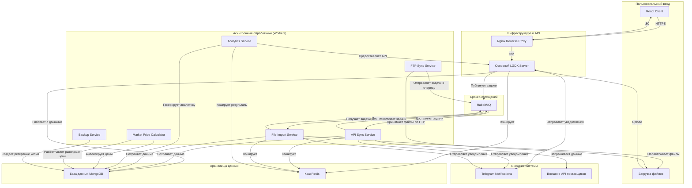

# 🏗️ Архитектура платформы LGDX

Этот документ описывает высокоуровневую архитектуру микросервисной платформы LGDX, ключевые компоненты и принципы их взаимодействия.

## 🎯 Два режима развертывания

LGDX поддерживает **два режима развертывания** для максимальной гибкости:

### 🔧 Development Mode (Docker Compose)
- Простое развертывание для быстрой разработки
- Все сервисы на одном хосте
- Минимальная конфигурация мониторинга
- Быстрый старт и остановка

### 🚀 Production Mode (Docker Swarm)
- Высокая доступность и масштабируемость
- Автоматическое восстановление сервисов
- Load balancing между репликами
- Полный мониторинг и алерты

## 📊 Архитектурная диаграмма



## 📜 Описание компонентов

### **1. Основной LGDX Server (`lgdx-server`)**
-   **Роль**: Ядро системы, обрабатывающее синхронные запросы.
-   **Технологии**: Node.js, Express.js, TypeScript.
-   **Обязанности**:
    -   Предоставление REST API для клиентского приложения (`React Client`).
    -   Аутентификация и авторизация пользователей.
    -   Прием файлов для последующей обработки.
    -   Публикация задач (например, "синхронизировать продукты", "обработать файл") в брокер сообщений `RabbitMQ`.
    -   Прямое взаимодействие с базой данных `MongoDB` и кэшем `Redis` для быстрых операций.

### **2. Асинхронные обработчики (Workers)**
Это микросервисы, которые выполняют "тяжелые" или длительные задачи в фоновом режиме, не блокируя основной сервер и пользовательский интерфейс.

#### **API Product Sync Service**
-   **Роль**: Синхронизация данных о продуктах с внешними поставщиками.
-   **Обязанности**:
    -   Планировщик публикует задачи в `RabbitMQ` (очередь `api_sync_tasks`), воркер потребляет их и выполняет синхронизацию.
    -   Обращение к API поставщиков для получения актуальных данных.
    -   Обработка, валидация и сохранение данных в `MongoDB`.
    -   Отправка уведомлений в `Telegram` о результатах синхронизации.

#### **File Product Import Service**
-   **Роль**: Обработка загруженных файлов (например, прайс-листов в CSV/Excel).
-   **Обязанности**:
    -   Подписка на очередь задач `file_upload_tasks` в `RabbitMQ`.
    -   Чтение и парсинг файлов.
    -   Валидация данных и сохранение их в `MongoDB`.
    -   Перемещение обработанных файлов в `processed` или `failed` директории.

#### **Analytics Service**
-   **Роль**: Генерация и кэширование аналитических данных о рынке алмазов.
-   **Обязанности**:
    -   Анализ данных о продуктах и категориях.
    -   Генерация отчетов по спросу и предложению.
    -   Кэширование результатов с TTL 24 часа.
    -   Предоставление API для фронтенда.
    -   Интеграция с MongoDB для хранения аналитических данных.

#### **Market Price Calculator Service**
-   **Роль**: Расчет и сглаживание рыночных цен на алмазы.
-   **Обязанности**:
    -   Статистический анализ ценовых данных.
    -   Продвинутое сглаживание аномальных цен.
    -   Валидация иерархий качества алмазов.
    -   Автоматическое планирование расчетов каждые 3 часа.
    -   Экономические коэффициенты: INR=0.40, GOLD=0.06, OIL=0.07.
    -   Кэш цен в Redis (TTL 24h) с endpoint `http://market-price-calculator:9100/market-price-cache`.

#### **Backup Service**
-   **Роль**: Автоматическое резервное копирование базы данных.
-   **Обязанности**:
    -   Создание ежедневных резервных копий MongoDB.
    -   Управление ротацией бэкапов (хранение 7 дней).
    -   Генерация отчетов о процессе резервного копирования.

#### **FTP Product Sync Service**
-   **Роль**: Синхронизация продуктов через FTP-протокол.
-   **Обязанности**:
    -   Предоставление безопасного FTP-сервера для поставщиков.
    -   Мониторинг загруженных файлов.
    -   **Rate Limiting** (1 загрузка каждые 12 часов на компанию).
    -   Автоматическая обработка файлов через RabbitMQ очередь.
    -   Telegram уведомления о превышении лимитов.
    -   PASV: `49.13.160.126`, порты `10000-10100`, хранилище `/app/ftp-data`.

#### **Legacy FTP Poller Service** (опционально)
-   **Роль**: Обслуживание компаний с legacy FTP (lgdeal.com): опрос удалённого FTP, загрузка файлов, расшифровка учётных данных.
-   **Взаимодействие**: Gateway (`server`) вызывает этот сервис по `LEGACY_POLLER_URL` при операциях set-legacy/sync для таких компаний.

#### **SSL Renewal Service**
-   **Роль**: Автоматическое обновление SSL сертификатов Let's Encrypt.
-   **Обязанности**:
    -   Проверка срока действия сертификата (еженедельно).
    -   Автоматическое обновление через Certbot при необходимости.
    -   Безопасный перезапуск Nginx без простоя.
    -   Резервное копирование сертификатов.
    -   Prometheus метрики (`ssl_certificate_expiry_days`).
    -   Telegram уведомления о результатах обновления.

#### **WhatsApp Baileys Worker** (внутри `lgdx-server`)
-   **Роль**: Управление WhatsApp-сессиями через библиотеку Baileys (не Meta Cloud API).
-   **Обязанности**:
    -   Запускается как отдельный Node.js Worker Thread (`whatsappBaileysWorker.ts`) внутри основного сервера.
    -   Получает входящие сообщения и регистрирует их через `POST /internal/whatsapp/message`.
    -   Отправляет текстовые ответы и медиа через Baileys socket.
    -   Хранит `BaileysReadMarker` registry для отметки сообщений как прочитанных.
    -   Сессия Baileys сохраняется между перезапусками через Docker volume (`/app/baileys-auth`).

#### **WhatsApp Job Processor** (BullMQ, внутри `lgdx-server`)
-   **Роль**: Асинхронная обработка входящих WhatsApp-сообщений через очередь BullMQ (Redis).
-   **Обязанности**:
    -   Дедупликация сообщений (предотвращение двойной обработки).
    -   Определение активности AI: если AI включён — вызывает OpenAI и отправляет ответ; если выключен (оператор) — оставляет сообщение непрочитанным.
    -   Отправка read-receipts через Baileys или Meta Cloud API после ответа AI.

### **3. Инфраструктурные компоненты**

#### **RabbitMQ**
-   **Роль**: Брокер сообщений, обеспечивающий надежную и асинхронную связь между основным сервером и worker'ами. Гарантирует, что ни одна задача не будет потеряна.

#### **MongoDB**
-   **Роль**: Основная база данных проекта. Хранит всю информацию о пользователях, продуктах, сделках и т.д.

#### **Redis**
-   **Роль**: In-memory кэш. Используется для хранения часто запрашиваемых данных (например, сессий, результатов фильтров), чтобы снизить нагрузку на `MongoDB` и ускорить ответы API.

#### **Nginx**
-   **Роль**: Reverse Proxy. Является единой точкой входа в систему.
-   **Обязанности**:
    -   Обслуживание статических файлов `React Client`.
    -   Перенаправление всех запросов к `/api` на `LGDX Server`.
    -   В продакшен-среде отвечает за терминирование SSL (HTTPS).

#### **React Client (`lgdx-client`)**
-   **Роль**: Веб-клиент, отдается через Nginx, использует API `lgdx-server`.

#### **Мониторинг и логирование**
-   **Prometheus** (9090) — метрики, retention 30d, правила `monitoring/rules`.
-   **Grafana** (3000) — root URL `https://lgdeal.com/grafana/`, дашборды, алерты.
-   **Alertmanager** (9093) — Telegram через `system_monitoring_bot_token`/`_chat_id`.
-   **Loki + Promtail** (3100) — логи контейнеров (global agents).
-   **node-exporter** (9100) и **cAdvisor** (8080) — метрики хоста/контейнеров.
-   **ssl-renewal-service** — метрики `/metrics`, статус `/status`.

## 🏆 Ключевые принципы архитектуры

-   **Асинхронность**: Длительные операции вынесены в фоновые обработчики, что делает интерфейс быстрым и отзывчивым.
-   **Отказоустойчивость**: Если один из worker'ов падает, `RabbitMQ` сохранит задачу и доставит ее другому worker'у, когда тот будет доступен.
-   **Масштабируемость**: Мы можем легко увеличить количество экземпляров (реплик) любого worker'а (`API Sync Service` или `File Import Service`) для обработки возросшей нагрузки, не затрагивая остальные части системы.
-   **Разделение ответственности (Separation of Concerns)**: Каждый сервис выполняет свою, четко определенную функцию, что упрощает разработку, тестирование и поддержку.

## 🔄 Docker Swarm особенности

### **Автоматическое восстановление**
- Сервисы автоматически перезапускаются при сбоях
- Health checks каждые 30 секунд
- Rolling updates без простоя

### **Load Balancing**
- Nginx распределяет нагрузку между репликами
- Встроенный балансировщик Docker Swarm
- Автоматическое обнаружение сервисов

### **Масштабирование**
```bash
# Увеличить количество реплик
docker service scale lgdx_lgdx-server=4
docker service scale lgdx_api-sync-service=3
```

### **Мониторинг**
- Prometheus собирает метрики
- Grafana визуализирует данные
- Alertmanager отправляет уведомления
- Loki + Promtail для централизованного логирования (экономия ~3.5GB памяти по сравнению с ELK Stack) 